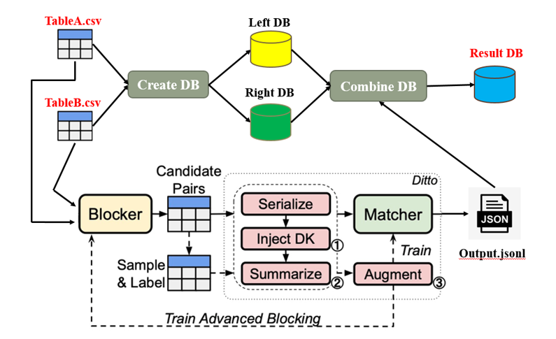

# Deep Entity Matching System with Self-supervised Pre-Trained Language model

*Update: a new light-weight version based on new versions of Transformers*

Entity Matching (EM) refers to the problem of determining whether two data entries refer to the same real-world entity. The objective is to determine the set of pairs of data entries, one entry from each table so that each pair of entries refer to the same real world object. To this end, we propose a Deep Entity Matching System with Self-supervised Pre-trained Language model, which is a complete EM system combine DITTO with self-supervised learning into MySQL database management system(DBMS). Attribute to self-supervised learning(SSL) we adapted, our system is forced to learn “harder” to improve the model’s matching capability. Some dark knowledge and discriminative representations are also acquired from the learning process. Comprehensive experiments on different real-world large-scale EM benchmarks clearly demonstrate the superiority of our approach. Finally, we also cleverly integrate Blocker, Matcher and DBMS these three separate components together and provide user a convenient end-to-end EM solution.

## Requirements

* Python 3.7.7
* PyTorch 1.9
* HuggingFace Transformers 4.9.2
* Spacy with the ``en_core_web_lg`` models
* NVIDIA Apex (fp16 training)

Install required packages
```
# install requirements
pip install -r requirements.txt
conda install -c conda-forge nvidia-apex

# some issue with colab
pip3 install --upgrade "urllib3==1.25.4" awscli
pip3 install transformers
pip3 install sentence_transformers
pip3 install jsonlines
pip3 install tensorboardX
pip3 install -U spacy
python3 -m spacy download en_core_web_lg
```

## The EM pipeline

A typical EM pipeline consists of two phases: blocking and matching. 

The blocking phase typically consists of simple heuristics that reduce the number of candidate pairs to perform the pairwise comparisons. Ditto optimizes the matching phase which performs the actual pairwise comparisons. The input to Ditto consists of a set of labeled candidate data entry pairs. Each data entry is pre-serialized into the following format:
```
COL title VAL microsoft visio standard 2007 version upgrade COL manufacturer VAL microsoft COL price VAL 129.95
```
where ``COL`` and ``VAL`` are special tokens to indicate the starts of attribute names and attribute values. A complete example pair is of the format
```
<entry_1> \t <entry_2> \t <label>
```
where the two entries are serialized and ``<label>`` is either ``0`` (no-match) or ``1`` (match). In our experiments, we evaluated Ditto using two benchmarks:
* the [ER_Magellan benchmarks](https://github.com/anhaidgroup/deepmatcher/blob/master/Datasets.md) used in the [DeepMatcher paper](http://pages.cs.wisc.edu/~anhai/papers1/deepmatcher-sigmod18.pdf). This benchmark contains 13 datasets of 3 categories: ``Structured``, ``Dirty``, and ``Textual`` representing different dataset characteristics. 
* the [WDC product matching benchmark](http://webdatacommons.org/largescaleproductcorpus/v2/index.html). This benchmark contains e-commerce product offering pairs from 4 domains: ``cameras``, ``computers``, ``shoes``, and ``watches``. The training data of each domain is also sub-sampled into different sizes, ``small``, ``medium``, ``large``, and ``xlarge`` to test the label efficiency of the models. 

We provide the serialized version of their datasets in ``data/``. The dataset configurations can be found in ``configs.json``. 

## Training with SSL_Ditto

To train the matching model with SSL_Ditto:
```
!CUDA_VISIBLE_DEVICES=0 python3 train_ditto.py \
  --task Structured/Walmart-Amazon \
  --batch_size 64 \
  --max_len 128 \
  --lr 3e-5 \
  --n_epochs 30 \
  --finetuning \
  --lm roberta \
  --fp16 \
  --da all \
  --dk product \
  --save_model
```

The meaning of the flags:
* ``--task``: the name of the tasks (see ``configs.json``)
* ``--batch_size``, ``--max_len``, ``--lr``, ``--n_epochs``: the batch size, max sequence length, learning rate, and the number of epochs
* ``--lm``: the language model. We now support ``bert``, ``distilbert``, and ``albert`` (``distilbert`` by default).
* ``--fp16``: whether train with the half-precision floating point optimization
* ``--da``, ``--dk``, ``--summarize``: the 3 optimizations of Ditto. See the followings for details.
* ``--save_model``: if this flag is on, then save the checkpoint to ``{logdir}/{task}/model.pt``.

## To run the matching models
Use the command:
```
!CUDA_VISIBLE_DEVICES=0 python3 matcher.py \
  --task Dirty/DBLP-ACM \
  --input_path input/candidates.jsonl \
  --output_path output/output.jsonl \
  --lm roberta \
  --max_len 128 \
  --use_gpu \
  --fp16 \
  --checkpoint_path checkpoints/
```
where ``--task`` is the task name, ``--input_path`` is the input file of the candidate pairs in the jsonlines format, ``--output_path`` is the output path, and ``checkpoint_path`` is the path to the model checkpoint (same as ``--logdir`` when training). The language model ``--lm`` and ``--max_len`` should be set to the same as the one used in training. The same ``--dk`` and ``--summarize`` flags also need to be specified if they are used at the training time.

## Colab notebook

1. You can also run training(blocker and matcher) and prediction using this colab [notebook]: https://colab.research.google.com/drive/1VM9RtpJz7_D--HEMeqmywCmjdDVwuQcN?usp=sharing).
2. End-to-end colab [notebook] version: https://colab.research.google.com/drive/1gkjFQbgFafryGWIklPBy0TjWykQorm8b?usp=sharing
Here have two file DITTO_combine.py and create_database.py. "create_database.py" is use to create a database in MySQL DBMS by two table(csv file). After the model output the EM prediction results, "DITTO_combine.py" will utilize the jsonl file and integral two database together in MySQL 
